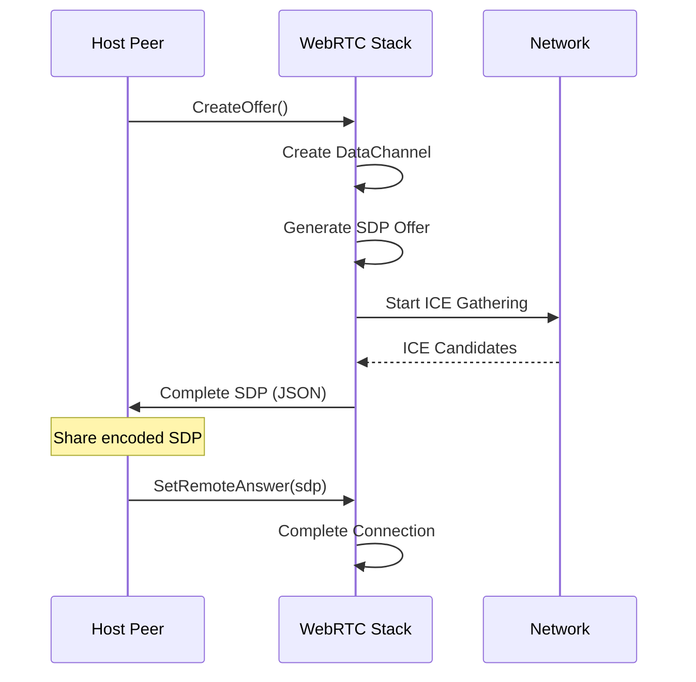
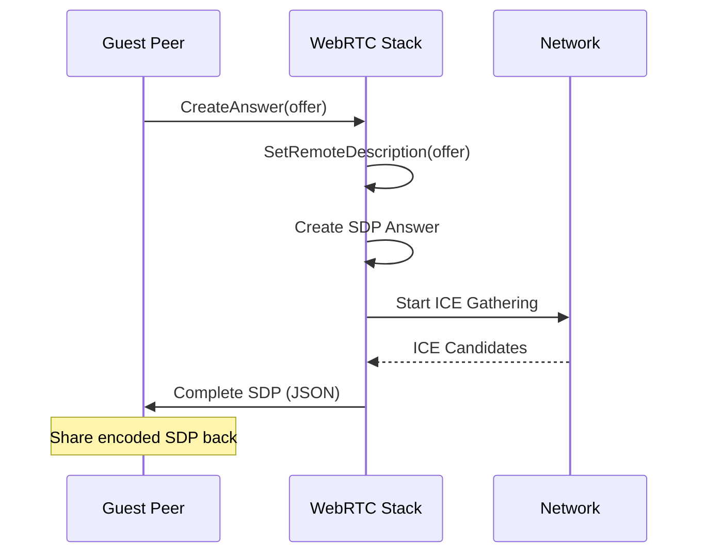

# pkg/webrtc Documentation

## Overview

The `pkg/webrtc` package provides a simplified, testable interface for WebRTC peer-to-peer connections. It abstracts away the complexity of the [pion/webrtc](https://github.com/pion/webrtc) library behind a clean interface that can be easily mocked for testing.

## Architecture

```
┌─────────────────┐    implements    ┌─────────────────┐
│  Peer Interface │ ◄──────────────── │   RealPeer      │
└─────────────────┘                  └─────────────────┘
                                              │
                                              ▼
                                     ┌─────────────────┐
                                     │ pion/webrtc     │
                                     │ PeerConnection  │
                                     └─────────────────┘
```

The package follows the **Interface Segregation Principle** - the `Peer` interface only exposes what clients need, hiding pion's complex types behind simple strings and byte slices.

## Core Components

### 1. Peer Interface

The `Peer` interface defines the contract for WebRTC peer connections:

```go
type Peer interface {
    CreateOffer() (string, error)
    SetRemoteAnswer(sdp string) error
    CreateAnswer(offer string) (string, error)
    SetRemoteOffer(sdp string) error
    Send(data []byte) error
    OnMessage(callback func([]byte))
    OnStateChange(callback func(string))
    Close() error
}
```

**Design Decisions:**
- **String-based SDPs**: Instead of exposing `webrtc.SessionDescription`, we use JSON strings for easier serialization and debugging
- **Callback-based events**: Async message and state change notifications via function callbacks
- **Error returns**: All operations can fail, so every method returns an error where appropriate
- **Simple types**: Only strings, bytes, and errors - no complex WebRTC types leak through

### 2. RealPeer Implementation

`RealPeer` is the concrete implementation that uses pion/webrtc under the hood.

#### Key Fields

```go
type RealPeer struct {
    pc          *webrtc.PeerConnection  // The underlying WebRTC connection
    dataChannel *webrtc.DataChannel     // Single "chat" data channel
    onMessage   func([]byte)            // Message callback
    onStateChange func(string)          // State change callback
    mu          sync.RWMutex            // Protects callback access
}
```

**Thread Safety**: The `sync.RWMutex` protects concurrent access to callbacks. Multiple goroutines can read callbacks simultaneously, but only one can write at a time.

## Connection Flow

### Host (Offerer) Flow



### Guest (Answerer) Flow



## Key Implementation Details

### SDP Handling

SDPs are serialized as JSON for easier handling:

```go
// Example SDP JSON structure
{
    "type": "offer",  // or "answer"
    "sdp": "v=0\r\no=- 123456 2 IN IP4 127.0.0.1\r\n..."
}
```

**Why JSON?**
- **Debuggable**: Easy to inspect SDP contents
- **Standardized**: Matches WebRTC JavaScript API format
- **Extensible**: Can add metadata later without breaking compatibility

### ICE Gathering

```go
// Wait for ICE gathering to complete before returning SDP
gatherComplete := webrtc.GatheringCompletePromise(p.pc)
<-gatherComplete
```

**Why wait for ICE gathering?**
- **Complete SDPs**: Ensures all network candidates are included
- **Better connectivity**: Maximizes chances of direct connection
- **Predictable behavior**: SDP is fully formed when returned

### Data Channel Configuration

```go
dcConfig := &webrtc.DataChannelInit{
    Ordered: &[]bool{true}[0], // Pointer to true
}
dc, err := p.pc.CreateDataChannel("chat", dcConfig)
```

**Configuration choices:**
- **Ordered delivery**: Messages arrive in the order they were sent
- **Named channel**: "chat" makes debugging easier
- **Single channel**: Simplifies the implementation and reduces complexity

### Error Handling Strategy

The package uses **fail-fast** error handling:

```go
func (p *RealPeer) Send(data []byte) error {
    if p.dataChannel == nil {
        return webrtc.ErrDataChannelNotOpen
    }
    if p.dataChannel.ReadyState() != webrtc.DataChannelStateOpen {
        return webrtc.ErrDataChannelNotOpen
    }
    return p.dataChannel.Send(data)
}
```

**Benefits:**
- **Early detection**: Problems are caught immediately
- **Clear error messages**: Uses pion's standard error types
- **No silent failures**: Every error condition is reported

## Event Handling

### Connection State Changes

```go
pc.OnConnectionStateChange(func(state webrtc.PeerConnectionState) {
    log.Printf("Connection state changed: %s", state.String())
    peer.mu.RLock()
    callback := peer.onStateChange
    peer.mu.RUnlock()
    
    if callback != nil {
        callback(state.String())
    }
})
```

**Possible states:**
- `"new"` - Initial state
- `"connecting"` - ICE negotiation in progress
- `"connected"` - Connection established
- `"disconnected"` - Temporary network interruption
- `"failed"` - Connection permanently failed
- `"closed"` - Connection closed

### Message Handling

```go
p.dataChannel.OnMessage(func(msg webrtc.DataChannelMessage) {
    log.Printf("Received message: %s", string(msg.Data))
    
    p.mu.RLock()
    callback := p.onMessage
    p.mu.RUnlock()
    
    if callback != nil {
        callback(msg.Data)
    }
})
```

**Thread safety pattern:**
1. Acquire read lock
2. Copy callback reference
3. Release lock
4. Call callback (outside lock to prevent deadlocks)

## Network Configuration

### ICE Servers

```go
config := webrtc.Configuration{
    ICEServers: []webrtc.ICEServer{
        {
            URLs: []string{"stun:stun.l.google.com:19302"},
        },
    },
}
```

**Current setup:**
- **STUN only**: Helps with NAT traversal for direct connections
- **Google STUN**: Free, reliable, widely accessible
- **No TURN**: Direct connections only (TURN servers added later)

### Connection Types

The implementation will attempt connections in this order:
1. **Host candidates** - Direct connection (same network)
2. **Server reflexive** - Through STUN (different networks, permissive NATs)
3. **Relay candidates** - Through TURN (when TURN is configured)

## Testing Strategy

### Unit Tests

The tests focus on the **public interface behavior**:

```go
func TestRealPeer_CreateOffer(t *testing.T) {
    peer, err := NewRealPeer()
    require.NoError(t, err)
    defer peer.Close()
    
    offer, err := peer.CreateOffer()
    require.NoError(t, err)
    
    // Verify JSON structure
    var offerMap map[string]interface{}
    err = json.Unmarshal([]byte(offer), &offerMap)
    require.NoError(t, err)
    
    assert.Equal(t, "offer", offerMap["type"])
    assert.NotEmpty(t, offerMap["sdp"])
}
```

**What we test:**
- ✅ Interface compliance
- ✅ Error handling
- ✅ SDP format validation
- ✅ Thread safety
- ✅ Resource cleanup

**What we don't test:**
- ❌ Actual network connections (integration tests)
- ❌ Pion library internals (trust the library)
- ❌ ICE negotiation details (too complex for unit tests)

### Mock-Friendly Design

The interface enables easy mocking:

```go
// In tests, you can use a fake implementation
type FakePeer struct {
    sentMessages [][]byte
    onMessage func([]byte)
}

func (f *FakePeer) Send(data []byte) error {
    f.sentMessages = append(f.sentMessages, data)
    return nil
}

func (f *FakePeer) OnMessage(callback func([]byte)) {
    f.onMessage = callback
}

// Test your business logic without real network
var peer Peer = &FakePeer{}
```

## Usage Examples

### Basic Peer-to-Peer Connection

```go
package main

import (
    "fmt"
    "p2p-chat/pkg/webrtc"
)

func main() {
    // Host creates offer
    host, err := webrtc.NewRealPeer()
    if err != nil {
        panic(err)
    }
    defer host.Close()
    
    // Set up message handler
    host.OnMessage(func(data []byte) {
        fmt.Printf("Host received: %s\n", string(data))
    })
    
    // Set up state handler
    host.OnStateChange(func(state string) {
        fmt.Printf("Host connection state: %s\n", state)
    })
    
    // Create offer
    offer, err := host.CreateOffer()
    if err != nil {
        panic(err)
    }
    
    fmt.Printf("Share this offer: %s\n", offer)
    
    // In a real app, you'd share this offer with the other peer
    // and get an answer back, then call host.SetRemoteAnswer(answer)
}
```

### Guest Joining

```go
// Guest receives offer and creates answer
guest, err := webrtc.NewRealPeer()
if err != nil {
    panic(err)
}
defer guest.Close()

// Set up handlers
guest.OnMessage(func(data []byte) {
    fmt.Printf("Guest received: %s\n", string(data))
})

// Create answer from host's offer
answer, err := guest.CreateAnswer(hostOffer)
if err != nil {
    panic(err)
}

fmt.Printf("Send this answer back: %s\n", answer)
```

## Limitations and Future Improvements

### Current Limitations

1. **No TURN servers**: Only works with direct connections and STUN
2. **Single data channel**: Only one "chat" channel per connection
3. **No reconnection**: Connection failures require full restart
4. **No bandwidth control**: No message rate limiting or flow control

### Planned Improvements

1. **Add TURN support**: For connections behind strict firewalls
2. **Connection pooling**: Reuse connections efficiently
3. **Auto-reconnection**: Handle temporary network failures
4. **Multiple channels**: Support different message types on separate channels
5. **Compression**: Reduce bandwidth usage for large messages

## Security Considerations

### Built-in Security

- **DTLS encryption**: All data channel messages are encrypted by default
- **SRTP for media**: Not used in this implementation, but available
- **ICE authentication**: Prevents unauthorized connection attempts

### Additional Considerations

- **Message validation**: Validate all incoming messages before processing
- **Rate limiting**: Prevent message flooding attacks
- **Access control**: Use tokens or other mechanisms to control who can connect

## Performance Characteristics

### Memory Usage

- **Base overhead**: ~100KB per peer connection
- **Message buffering**: Depends on application usage
- **ICE candidates**: ~1KB per candidate (typically 5-20 candidates)

### Latency

- **Direct connection**: 1-10ms (same as network RTT)
- **STUN connection**: 10-50ms additional latency
- **TURN connection**: 50-200ms additional latency

### Throughput

- **Theoretical maximum**: Several Mbps per data channel
- **Practical limit**: Depends on network conditions and message size
- **Ordered delivery**: May reduce throughput vs unordered

## Debugging Tips

### Connection Issues

1. **Check logs**: Look for ICE state changes and connection state
2. **Verify SDP**: Ensure SDP JSON is valid and contains media lines
3. **Network testing**: Try on same LAN first, then across networks
4. **Firewall check**: Ensure UDP traffic is allowed

### Common Problems

```go
// Problem: Send fails with "data channel not open"
err := peer.Send([]byte("message"))
if err == webrtc.ErrDataChannelNotOpen {
    // Wait for connection to establish or handle gracefully
}

// Problem: No messages received
peer.OnMessage(func(data []byte) {
    // Make sure this callback is set BEFORE connection
})
```

### Logging

Enable more detailed logging:

```go
// Add more verbose logging in production
log.SetLevel(log.DebugLevel) // If using a structured logger
```

The current implementation uses `log.Printf` for simplicity, but in production you might want structured logging with different levels.
